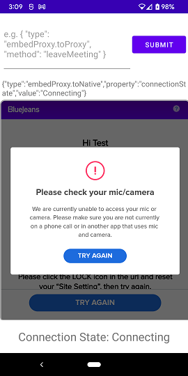

# EmbedSDK Android Sample App
This is a sample android app which shows how BlueJeans embed SDK can be integrated into an android project.

### Dependencies:
To get this project up and running please install the following dependencies:
1. [JDK 1.8 or higher](https://www.oracle.com/java/technologies/downloads/#java8-windows)
2. [Android Studio](https://developer.android.com/studio)

With the above dependencies installed, you can launch the application by simply clicking the "Run" button from Android Studio's toolbar.

### Platform Requirements:
1. Minimum SDK version: 26
2. Target SDK version: 31

### Permissions:
In order to successfully integrate the embed SDK into an android application, following permissions must be declared:
1. INTERNET
2. BLUETOOTH
3. CAMERA
4. MODIFY_AUDIO_SETTINGS
5. RECORD_AUDIO

**Note: Failing to provide the `MODIFY_AUDIO_SETTINGS` or `RECORD_AUDIO` prevents the user from joining the meeting and the following screenshot is shown.**


### Features:
1. Join using JSON:
The JSON payload that is passed to the embed SDK for joining a meeting can be directly punched into the sample app.

2. Join using meeting ID:
If adding/editing a JSON blob is cumbersome for you then simply provide the meeting ID, passcode (if required) and the name of the user will result in the app internally constructing the JSON for you and joining the meeting.

3. Dynamic updation of the meeting state:
Once into a meeting, the current meeting state is always displayed at the bottom of the screen.
   
## Build Steps
No intricate build steps are involved. Just open the repository in Android Studio and press RUN.

## Joining a meeting
1. Either within the JSON, or the join with ID tab - fill in the meeting Id, passcode and name fields
2. Press 'Join'
   
### Initializing the WebView:
Before you begin with initializing the WebView, it is imperative that you declare a custom JavaScript interface which would facilitate the messages to flow from the embed SDK to the native application.
```kotlin
class WebViewJsInterface {

    @JavascriptInterface
    fun receiveMessage(data: String?) {

    }
}
```
Please ensure that you add the annotation `@JavascriptInterface` to the method that would be receiving the JavaScript messages from the embed SDK.

Also, make sure to declare a custom chrome client which would grant the microphone and camera permission to the WebView. A chrome client can be defined in the following way.
```kotlin
class MyChromeClient : WebChromeClient() {
    private val TAG = "MyChromeClient"

    private val permissions = arrayOf(PermissionRequest.RESOURCE_AUDIO_CAPTURE, PermissionRequest.RESOURCE_VIDEO_CAPTURE)

    /**
     * This method grants the camera and microphone permission required by the [WebView]
     * to connect to a meeting.
     */
    @TargetApi(Build.VERSION_CODES.LOLLIPOP)
    override fun onPermissionRequest(request: PermissionRequest?) {
        try {
            request?.grant(permissions)
        } catch (e: Exception) {
            Log.e(TAG, "Exception occured while granting permission to the webview: $e")
        }
    }
}
```

Once JavaScriptInterface and custom chrome client declared, it is time to declare a custom web view client. This client will offer callbacks whenever a new page is loaded into the WebView.
```kotlin
const val JS_EVENT_CALLBACK =
    "function receiveMessage(event) {Android.receiveMessage(" +
            "JSON.stringify(event.data));} \n window.addEventListener(\"message\", receiveMessage, false);"

class MyWebViewClient : WebViewClient() {

    private val TAG = "MyWebViewClient"

    private val meetingJson = {}    // This is your meeting JSON with all meeting properties and UI props

    override fun onPageFinished(view: WebView?, url: String?) {
        view?.evaluateJavascript(JS_EVENT_CALLBACK, null)
        view?.evaluateJavascript(meetingJson, null)
    }
}
```

**Note: The second argument to `window.addEventListener` should always be the JavaScript method that you declare, i.e. in our case, `receiveMessage`. 
Also, the `receiveMessage` JavaScript method should call the Android's JavaScript interface method to receive message. Which in our case is again `receiveMessage`. 
In order to call Android's Javascript interface method please add `Android.receiveMessage`. Here `receiveMessage` is the name of the Javascript interface method defined in our custom JavaScript interface class and 
`Android` is just an identifier that is used to recognize the JavaScript interface. This identifier can be any string value. Please bear in mind that whatever string value you declare here should be 
specified while adding the JavaScript interface to the `WebView`. Please check the code snippet below for an example.**

Now with the above setup ready, we are ready to initialize the WebView.
```kotlin
webView = findViewById(R.id.web_view)
webView.clearCache(true)
webView.settings.cacheMode = WebSettings.LOAD_CACHE_ELSE_NETWORK
webView.settings.domStorageEnabled = true
webView.settings.javaScriptEnabled = true
webView.settings.useWideViewPort = true
webView.settings.mediaPlaybackRequiresUserGesture = false

webView.webViewClient = MyWebViewClient(jsonObject)
webView.webChromeClient = MyChromeClient()
webView.addJavascriptInterface(
    WebViewJsInterface(), "Android" 
)
```

#### Ending call from native app:
If you wish to end the call using the native application, rather than the **"END"** button offered by the embed SDK UI then execute the following JavaScript on the WebView's instance.
```kotlin
val LEAVE_MEETING_JS = "window.postMessage({\n" +
        "        \"type\": \"embedProxy.toProxy\",\n" +
        "        \"method\" : \"leave\",\n" +
        "        \"args\": []\n" +
        "    })"

webView.evaluateJavascript(LEAVE_MEETING_JS, null)
```


